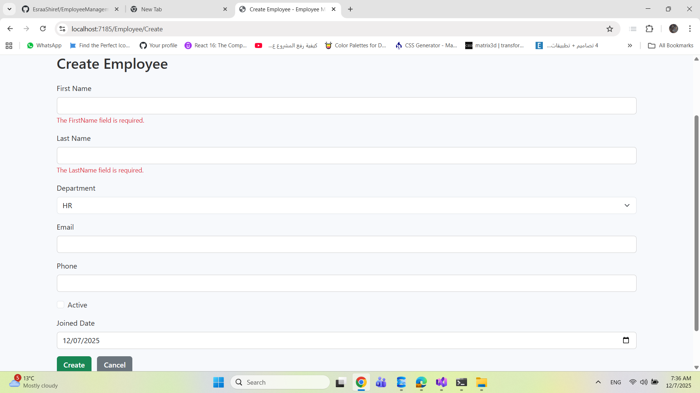

# EmployeeManagementSystem

## Description

Interview test project built using ASP.NET Core 8 MVC and Entity Framework Core.
It demonstrates a basic CRUD application with a focus on backend and frontend development skills, including data validation, UI handling, and clean .NET practices.

The project covers:

* Displaying and managing employee records.
* Server-side pagination and filtering.
* Forms with various input types including string, email, date, boolean, and dropdowns.
* Clean separation of concerns using Controllers, Services, and Repositories.
* Razor Views for UI rendering.
* Client-side and server-side validation.

---

## Key Techniques

* Efficient querying and filtering in the repository layer.
* Safe filtering to prevent null reference exceptions.
* Server-side pagination for large datasets.
* Separation of concerns:

  * Controllers handle HTTP requests.
  * Services handle business logic.
  * Repositories handle database access.
* Responsive UI using Bootstrap 5.
* Razor Views for dynamic content rendering.
* Validation using Data Annotations and ModelState.

---

## Notable Technologies and Libraries

* **ASP.NET Core 8 MVC** – Web framework.
* **Entity Framework Core** – Object-relational mapper.
* **Bootstrap 5** – Responsive front-end styling.
* **Razor Views** – Template rendering for server-side HTML.
* **LINQ** – Querying collections and database entities efficiently.

---

## Project Structure

```
EmployeeManagementSystem/
│
├── Controllers/          # Handles HTTP requests and calls services
├── Data/                 # DbContext and database initializer
├── Models/               # Entity classes for database tables
├── Repositories/         # CRUD operations and database access
├── Services/             # Business logic interacting with Repositories
├── ViewModels/           # Data transfer objects for Views
├── Views/
│   ├── Employee/         # Razor views for CRUD operations
│   └── Shared/           # Layouts, partial views, pagination, sortable column helpers
├── wwwroot/
│   └── css/              # Custom styles for the UI
├── EmployeeManagementSystem.csproj
├── Program.cs
└── README.md
```

---

## Key Code Snippets

### Safe Filtering

```csharp
var term = searchString?.Trim() ?? "";
query = query.Where(e => (e.FirstName ?? "").Contains(term)
                      || (e.LastName ?? "").Contains(term));
```

### Server-Side Pagination

```csharp
var pageSize = 10;
var pagedEmployees = query.Skip((pageNumber - 1) * pageSize)
                          .Take(pageSize)
                          .ToList();
```

### Repository Pattern Example

```csharp
public class EmployeeRepository : IEmployeeRepository
{
    private readonly AppDbContext _context;
    public EmployeeRepository(AppDbContext context) => _context = context;

    public IEnumerable<Employee> GetAll() => _context.Employees.ToList();
}
```

---

## Architecture Diagram

```
  +-------------+
  |   Browser   |
  +-------------+
         |
         v
  +-------------+
  |   Razor     |
  |   Views     |
  +-------------+
         |
         v
  +-----------------+
  | Controllers      |
  | (EmployeeController)|
  +-----------------+
         |
         v
  +-----------------+
  |   Services       |
  | (EmployeeService)|
  +-----------------+
         |
         v
  +-----------------+
  |  Repositories    |
  | (EmployeeRepository) |
  +-----------------+
         |
         v
  +-----------------+
  |   Database       |
  | (SQL Server / EF Core)|
  +-----------------+
```

---

## Features

* **Query Page** – Displays a table of employees with actions: View, Edit, Delete.
* **Filtering/Search** – Search employees by name or other fields.
* **Paging** – Handles large datasets efficiently.
* **Create Page** – Form to add new employees with multiple input types:

  * String, Email, DateTime
  * Boolean (checkbox)
  * Dropdown/multi-choice
* **Validation** – Client-side via Data Annotations and server-side via ModelState.
* **Responsive UI** – Mobile-friendly using Bootstrap 5.

---

## Screenshots

**Employee List Page**


**Create Employee Page**



**Employee Details Page**


**Edit Employee Page**


**Delete Employee Page**


**Filter&Sort**


