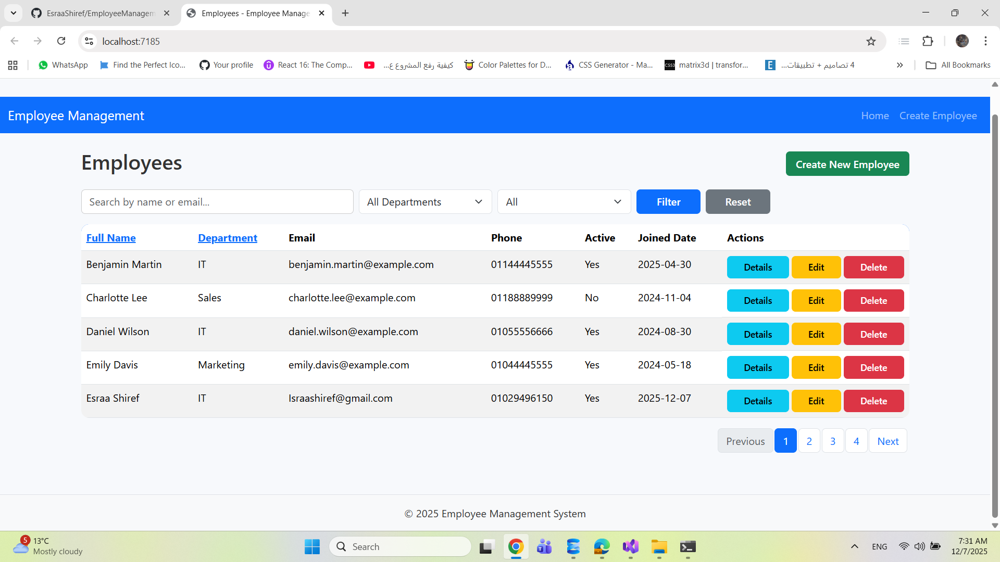
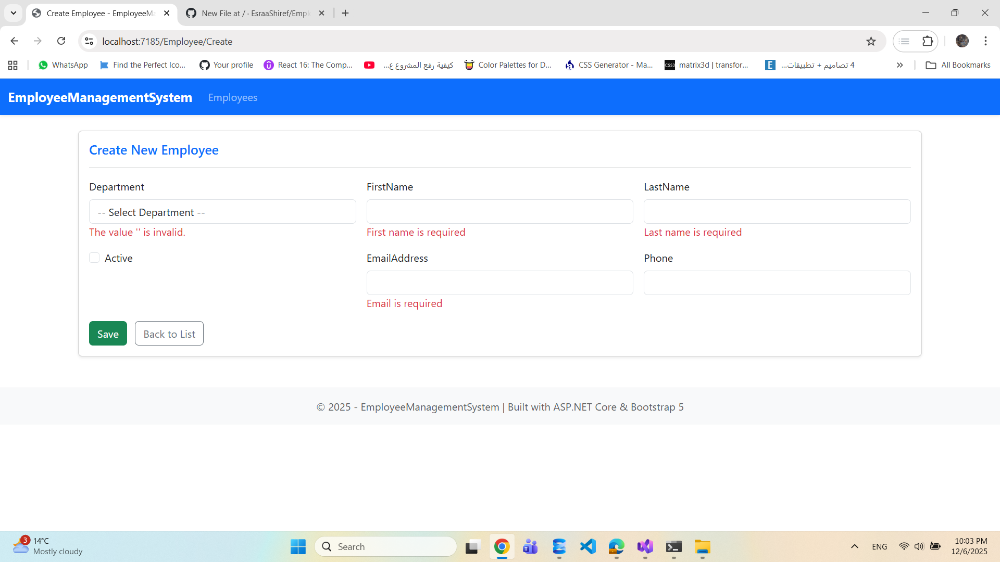
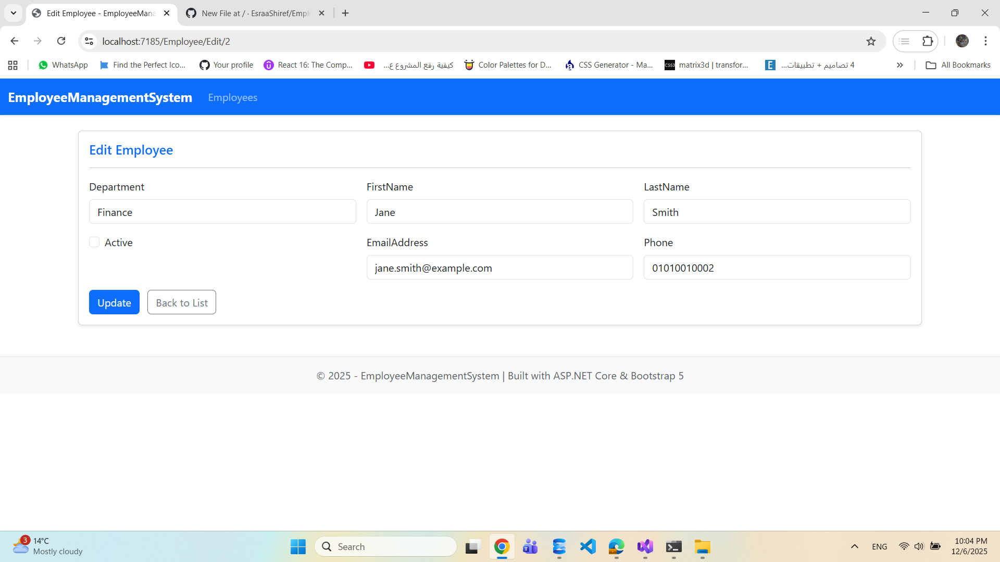
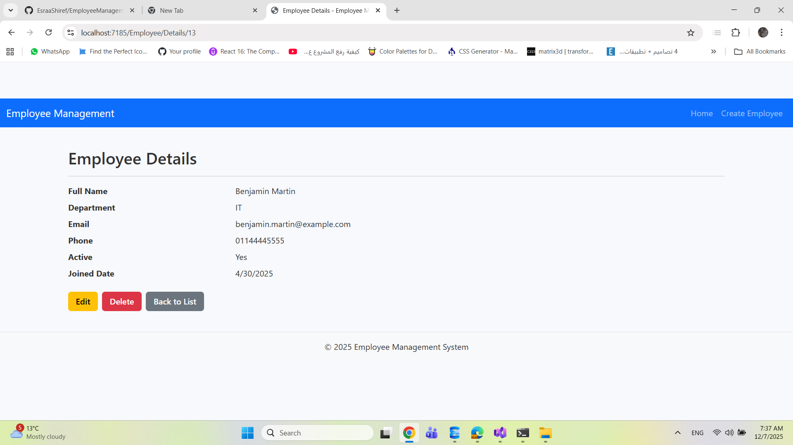
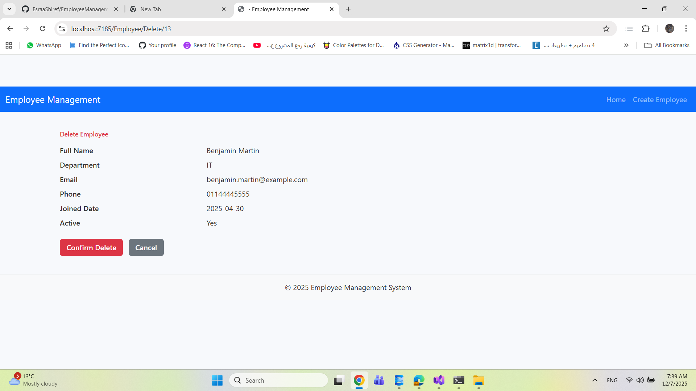

# Employee Management System - ASP.NET Core 8 MVC
A complete ASP.NET Core 8 MVC application implementing CRUD operations, multi-column search, dynamic sorting, pagination, and fully responsive Bootstrap UI.  
This project was developed as part of an interview assessment requiring strong backend, frontend, and Entity Framework Core skills.

---

## 🚀 Features
- ✅ Complete CRUD Operations - Create, Read, Update, Delete employee records
- 🔍 Advanced Search - Multi-field search across employee attributes
- 📄 Pagination - Efficient data loading with configurable page size
- 📱 Responsive Design - Bootstrap 5 
- 🗄️ Database Seeding - Automatic initialization with sample data
- 🔗 Entity Framework Core - Code-first approach with SQL Server
- ✔️ Form Validation - Client and server-side validation
- 💬 Success Notifications - User feedback with TempData alerts

---

## 📸 Screenshots
### Employee List View


### Create New Employee


### Edit Employee


### Employee Details


### Delete Confirmation


### Search&sort 


---

## 📋 Prerequisites
- .NET 8.0 SDK or higher
- SQL Server (Express/Developer/Standard)
- Visual Studio 2025 or VS Code
- Basic knowledge of C# and ASP.NET Core MVC

---

## 🛠️ Technology Stack

| Category    | Technologies                     |
|------------|----------------------------------|
| Framework  | ASP.NET Core 8 MVC               |
| Language   | C# 12                            |
| ORM        | Entity Framework Core 8          |
| Database   | Microsoft SQL Server             |
| Frontend   | Bootstrap 5.3, jQuery 3.6       |
| Validation | jQuery Validation & Unobtrusive  |
| Architecture | MVC Pattern                     |

---

## ⚙️ Installation & Setup

1. **Clone the Repository**
```bash
git clone https://github.com/EsraaShiref/EmployeeManagementSystem.git
cd EmployeeManagementSystem
```

2. **Configure Database Connection**  
Update `appsettings.json` with your SQL Server connection string:
```json
{
  "ConnectionStrings": {
    "DefaultConnection": "Server=YOUR_SERVER;Database=EmployeeManagementSystemDB;Trusted_Connection=True;TrustServerCertificate=True"
  }
}
```

3. **Restore Dependencies**
```bash
dotnet restore
```

4. **Run the Application**
```bash
dotnet run
```

The application will automatically:
- Create the database if it doesn't exist
- Seed initial employee data
- Launch at `https://localhost:5001`

---

## 📁 Project Structure

```
EmployeeManagementSystem/
├── Controllers/
│   └── EmployeeController.cs      # Main CRUD logic with sorting/filtering
├── Data/
│   ├── AppDbContext.cs            # EF Core DbContext
│   └── DbInitializer.cs           # Database seeding logic
├── Models/
│   └── Employee.cs                # Employee entity model
├── Views/
│   ├── Employee/
│   │   ├── Index.cshtml           # List view with search/sort/pagination
│   │   ├── Create.cshtml          # Create form
│   │   ├── Edit.cshtml            # Edit form
│   │   ├── Details.cshtml         # Details view
│   │   └── Delete.cshtml          # Delete confirmation
│   └── Shared/
│       ├── _Layout.cshtml         # Master layout
│       ├── _Navbar.cshtml         # Navigation bar partial
│       ├── _Footer.cshtml         # Footer partial
│       ├── _Pagination.cshtml     # Pagination partial
│       ├── _SortableColumn.cshtml # Sortable column partial
│       └── _ValidationScriptsPartial.cshtml # Scripts for form validation
├── wwwroot/
│   ├── css/
│   │   └── modern-site.css        # Custom styles
│   └── js/
│       └── modern-site.js         # Custom scripts
├── .editorconfig                  # Code style configuration
├── .gitignore
├── README.md
├── appsettings.json
└── Program.cs                      # Application entry point
```

---

## 🎯 Key Implementation Highlights

## 📄 **Pagination Logic**

```csharp
int totalRecords = employees.Count;
int totalPages = (int)Math.Ceiling(totalRecords / (double)PageSize);

if (page < 1)
    page = 1;
if (page > totalPages && totalPages > 0)
    page = totalPages;

var pagedEmployees = employees
    .Skip((page - 1) * PageSize)
    .Take(PageSize)
    .ToList();
```

## 🔍 **Multi-Column Search**

```csharp
if (!string.IsNullOrEmpty(searchString))
{
    string lower = searchString.ToLower();

    employees = employees
        .Where(e =>
            e.FirstName.ToLower().Contains(lower) ||
            e.LastName.ToLower().Contains(lower) ||
            e.EmailAddress.ToLower().Contains(lower) ||
            e.Department.ToString().ToLower().Contains(lower))
        .ToList();
}
```

---

## 🔃 **Dynamic Sorting**

```csharp
employees = sortOrder switch
{
    "FullName" => employees.OrderBy(e => e.FirstName)
                          .ThenBy(e => e.LastName)
                          .ToList(),

    "FullName_desc" => employees.OrderByDescending(e => e.FirstName)
                               .ThenByDescending(e => e.LastName)
                               .ToList(),

    "Department" => employees.OrderBy(e => e.Department)
                             .ToList(),

    "Department_desc" => employees.OrderByDescending(e => e.Department)
                                 .ToList(),

    "JoinedDate" => employees.OrderBy(e => e.JoinedDate)
                             .ToList(),

    "JoinedDate_desc" => employees.OrderByDescending(e => e.JoinedDate)
                                 .ToList(),

    _ => employees.OrderBy(e => e.EmployeeID).ToList(),
};
```

---

## 🔧 Customization

**Change Page Size**  
In `EmployeeController.cs`:
```csharp
private const int PageSize = 6; // Modify this value
```

**Add New Fields**
1. Update `Employee.cs` model  
2. Create migration:
```bash
dotnet ef migrations add AddNewField
```
3. Update database:
```bash
dotnet ef database update
```
4. Update views to display new fields

**Change Database Provider**  
Replace SQL Server with PostgreSQL, MySQL, or SQLite by updating:
- NuGet packages
- Connection string in `appsettings.json`
- `UseSqlServer()` in `Program.cs`

---

## 🧪 Testing

Manual Testing Checklist:
- Create new employee record
- Edit existing employee
- Delete employee with confirmation
- Search by name, email, department
- Sort by each column (asc/desc)
- Navigate through pagination
- Validate form inputs
- Test responsive layout on mobile

---

## 📚 Learning Outcomes

This project demonstrates proficiency in:
- ASP.NET Core MVC architecture
- Entity Framework Core ORM
- Bootstrap responsive design
- Client-side and server-side validation
- Partial views and view components
- TempData for cross-request messaging
- Database initialization and seeding

---

